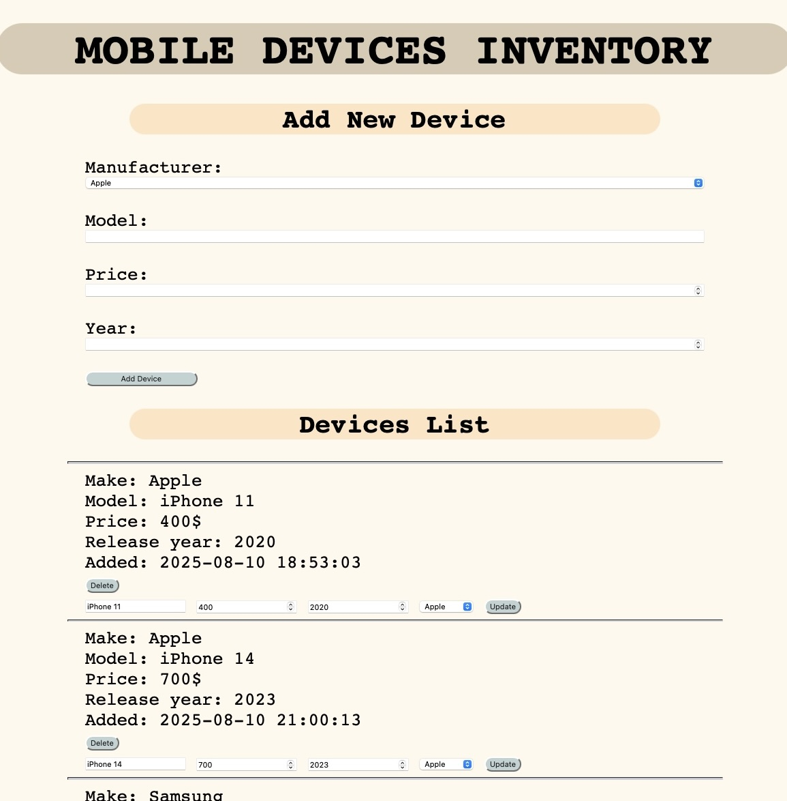

# 📱 Mobile Devices Inventory (Learning Project)

This is a simple PHP CRUD (Create, Read, Update, Delete) project created as part of my learning journey. 
The app allows you to manage a list of mobile devices by adding, updating, and deleting entries from a database.

> ⚠️ **Disclaimer**: This is a learning exercise.
>  The code contains mistakes, lack validation or security best practices, and is meant for educational purposes only.

---

## 💡 Features

- Add a new mobile device with model, manufacturer, price, and year.
- View all devices in a list.
- Update or delete existing devices.
- Manufacturers are fetched from a separate database table.

---

## 🧰 Technologies Used

- **PHP**
- **MySQL**
- **HTML**
- **CSS** (basic styling via `css/styling.css`)

---

## ⚙️ Setup Instructions

1. **Clone or download the project.**
2. **Set up a MySQL database** with two tables:
    - `manufacturer` (with `id`, `make`)
    - `devices` (with `id`, `manufacturer_id`, `model`, `price`, `make_year`, `import_date`)
3. **Update `connect.php`** with your database connection credentials.
4. Open `app.php` in your browser via a local server (e.g., XAMPP, WAMP, etc.).

---

## ❗ Notes

- This project uses raw SQL queries and does **not** use prepared statements (vulnerable to SQL injection).
- No frontend frameworks or advanced backend logic — just plain PHP and HTML.
- Code can and should be improved, and I'm actively learning better practices over time.

---

## 🖼️ Screenshot

Here’s a quick look at the app interface:

---

## 🧠 What I'm Learning

- Basic technical skills in web development.
- Basic PHP and MySQL integration.
- HTML forms and handling user input with PHP.
- How CRUD operations work.
- Structuring code and working with databases.

---

## ✅ To-Do (for learning & improvement)

- [ ] Add input validation and sanitization
- [ ] Switch to prepared statements (PDO or MySQLi)
- [ ] Add user feedback (success/error messages)
- [ ] Improve CSS styling
- [ ] Separate logic from presentation (MVC pattern)

---
